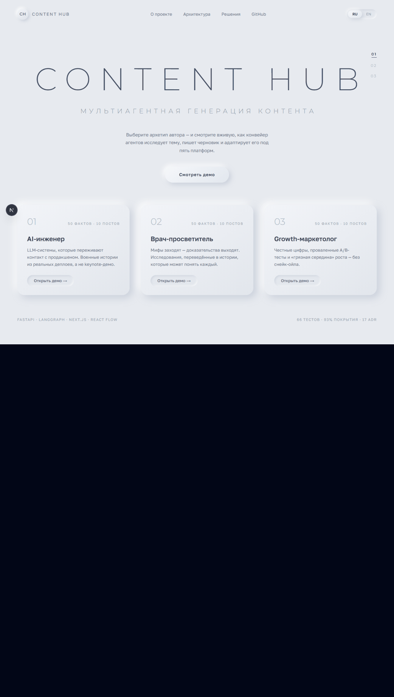

# EXAMPLES — what the demo looks like

> If the live demo is asleep or unreachable, this page shows exactly what should
> happen. Every image below was captured by the automated Playwright e2e run of
> the real application (`frontend/e2e/main-flow.spec.ts`) — not mockups.

## The full flow, in one GIF

## Step by step

### 1. Pick a demo personality

Three pre-loaded archetypes, each with 50 personality facts and 10 exemplar
posts embedded into vector memory (local Qwen3-Embedding-0.6B, 1024-dim).

### 2. Generate — and watch the agents work

Type a topic, hit Generate, and the LangGraph network lights up live over SSE:
Briefer → Researcher → Writer → five parallel Social Writers → Finalizer. Each
node shows its status and duration; the side panel streams intermediate
outputs. The result lands as platform tabs (Telegram / X / LinkedIn / Medium /
Threads) with per-platform tone, hashtags and character budgets.

### 3. Feed the system your own data

No hidden scrapers (see ADR-016) — data enters the system visibly. Paste a
post with its metrics; it is embedded on the spot into this session's memory.

### 4. Run the learning cycle

The Analyzer network merges the archetype's exemplar posts with everything you
ingested this session, sorts weakest→strongest, mines patterns, proposes memory
updates — and the Planner network suggests the next plan entries.

---

More: [README](README.md) · [DECISIONS.md — 17 ADRs](DECISIONS.md)
