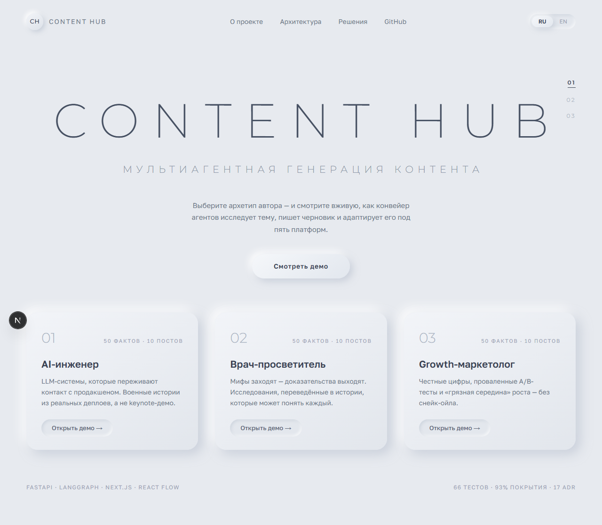
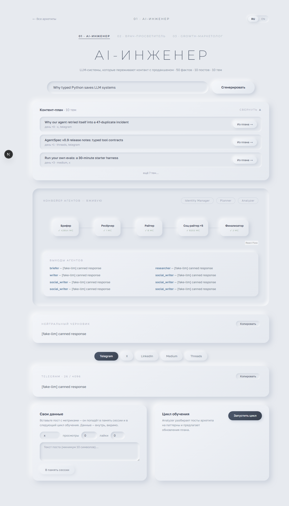
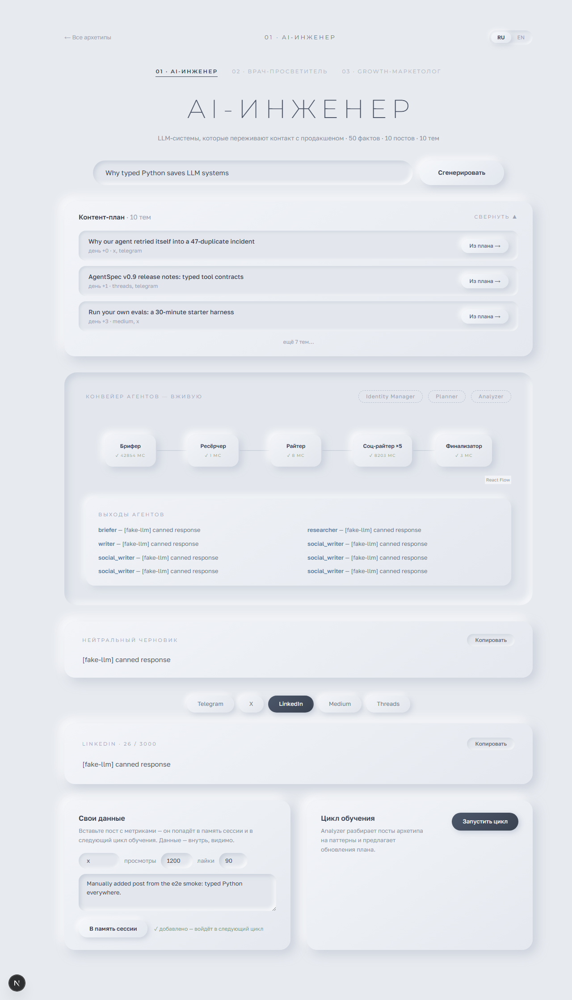
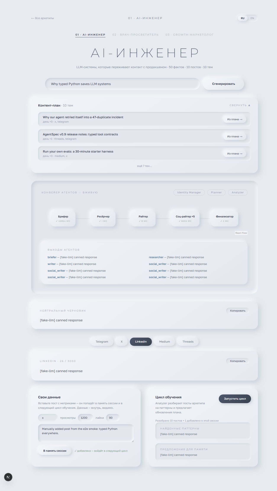

# Content-hub Showcase

**Публичная веб-демонстрация мультиагентной AI-системы генерации контента — с живым графом агентов в реальном времени.**

[English version → README.en.md](README.en.md)


**Live demo:** *(deploy pending)*

---

## Что это

Content-hub Showcase — портфолио-проект для роли AI Agent Engineer: публичная демо-версия мультиагентной системы, которая генерирует контент под выбранный архетип автора (AI Engineer / Growth Marketer / Physician Educator) и адаптирует его под 5 платформ — Telegram, X, LinkedIn, Medium, Threads.

Главная фича — **живой граф агентов на React Flow**: пока LangGraph-оркестрация работает на backend, каждый шаг пайплайна (retrieval → generation → adaptation → learning) стримится через SSE и анимируется в браузере в реальном времени. Вы не читаете *о* мультиагентной системе — вы смотрите, как она работает.

Дополнительно: видимая панель **Data Ingestion** (вместо скрытых скраперов — ADR-016) и демонстрационный **learning cycle** (event-triggered обучение по фидбеку).

**Стек:** FastAPI + LangGraph 1.1.6, локальные эмбеддинги Qwen3-Embedding-0.6B (1024-dim), Chroma (precomputed на build-этапе), ShallowRedisSaver-чекпоинтер поверх Redis/Upstash, SQLite STRICT, LLM-фолбэк Groq → OpenRouter. Frontend: Next.js 16.2.6, React 19, React Flow, Zustand + TanStack Query, Tailwind v4. Деплой: Vercel (frontend) + HuggingFace Spaces Docker (backend).

---

## Тройное доказательство глубины

Проект собран за короткий срок — и я понимаю, как это выглядит. Поэтому глубина проработки доказывается тремя независимыми способами.

### 1. Архитектурные решения — [DECISIONS.md](DECISIONS.md)

17 ADR (Architecture Decision Records): каждое решение — с контекстом, рассмотренными альтернативами, последствиями и защитой на собеседовании. От выбора LangGraph 1.1.6 и ShallowRedisSaver (ADR-009) до замены Gemini-эмбеддингов на локальную Qwen3-Embedding-0.6B (ADR-017) и намеренного удаления observability-стека (ADR-015).

### 2. Скриншоты

| | |
|---|---|
|  |  |
| *Главная: 3 демо-архетипа* | *Живой React Flow граф + результат по платформам* |
|  |  |
| *Панель Data Ingestion* | *Демо learning cycle* |

### 3. Behind the Scenes — честные заметки о процессе

- **Spec-driven разработка.** Код писался по заранее финализированным плану и архитектурной спецификации (plan → Architectural Specification → Product TS), а не «наощупь». Каждая задача имела acceptance criteria как чек-лист.
- **TDD.** Тесты писались вместе с кодом, не «потом»: pytest — 66 тестов, 93% покрытия; vitest — 22 теста; Playwright e2e проходит полный сценарий рекрутёра.
- **Пины версий, которых не существовало на PyPI.** Часть версий в спецификации была зафиксирована «на вырост» и на момент установки отсутствовала в индексе. Решение: сверка с реальным PyPI при установке, фиксация ближайших существующих версий и явная запись расхождений — вместо слепого копирования спеки.
- **Sync vs async Redis-чекпоинтер.** ShallowRedisSaver в синхронном варианте блокировал event loop FastAPI. Обнаружено на живом SSE-стриме (граф «замирал»), исправлено переходом на async-вариант чекпоинтера. Это открытие есть в истории коммитов, а не только в этом абзаце.
- **Redis 8 и FT.\*.** Redis-чекпоинтер LangGraph требует модули RediSearch (команды `FT.*`) — обычный Redis 7 не подходит. Поэтому dev-окружение поднимает Redis 8 через `docker-compose.dev.yml`, а в проде используется Upstash.
- **SQLite STRICT и TIMESTAMP.** В STRICT-режиме SQLite тип колонки `TIMESTAMP` невалиден (STRICT принимает только INT/INTEGER/REAL/TEXT/BLOB/ANY) — «привычные» схемы из туториалов падают на `CREATE TABLE`. Схема переписана под TEXT + ISO-8601 с валидацией на уровне приложения.

---

## AI-collaboration disclosure

> Claude Code был pair programmer для этого проекта. Я отвечал за: архитектурные решения (см. [DECISIONS.md](DECISIONS.md)), product decisions, debugging, testing. Claude отвечал за: implementation details, boilerplate, черновики документации. Это **не** AI-generated проект — это collaboration. Детали процесса — в секции Behind the Scenes выше.

---

## Quick start

Требования: Python 3.12+, Node.js 20+, Docker (для Redis 8).

### 0. Redis 8 (чекпоинтер LangGraph)

```bash
# из каталога showcase/
docker compose -f docker-compose.dev.yml up -d
```

### 1. Backend (FastAPI + LangGraph)

```bash
cd backend

python -m venv .venv
.venv\Scripts\activate            # Windows (source .venv/bin/activate на unix)
pip install -e ".[dev]"

copy .env.example .env            # cp на unix; ключи LLM — опционально, см. ниже

alembic upgrade head
python scripts/build_demo_db.py   # первый запуск скачивает Qwen3-Embedding-0.6B (~1.2 GB)

uvicorn content_hub_showcase.main:app --port 8000
```

Health check: `GET http://localhost:8000/api/v1/health`

### 2. Frontend (Next.js)

```bash
cd frontend
npm install
npm run dev                       # http://localhost:3000
```

### 3. Тесты

```bash
# backend (из showcase/backend)
pytest                            # 66 тестов, 93% coverage; API-ключи не нужны — LLM/эмбеддинги замоканы

# frontend (из showcase/frontend)
npm run test                      # vitest, 22 теста

# e2e (нужны оба запущенных сервера: backend :8000 + frontend :3000)
npx playwright test
```

### LLM-ключи

| Переменная | Роль |
|---|---|
| `GROQ_API_KEY` | основной провайдер (бесплатный tier) |
| `OPENROUTER_API_KEY` | фолбэк |

Без ключей backend работает в **fake-LLM dev-режиме** — весь флоу, включая живой граф, можно посмотреть локально без единого внешнего вызова.

---

## Если live demo недоступно

[EXAMPLES.md](EXAMPLES.md) — визуальный фолбэк: GIF главного флоу и скриншоты ключевых экранов. Если live demo не работает, эти материалы показывают, что должно происходить.

---

## Портфель проектов (distinct positioning)

| Проект | Фокус |
|---|---|
| **Content-hub** (этот репозиторий) | Мультиагентная **видимая** оркестрация + production deployment (Vercel + HF Spaces) |
| [Learning-hub](https://github.com/USERNAME/learning-hub) | RAG-стек: retrieval-пайплайны, эмбеддинги, оценка качества |
| [DEV-HUB V.6](https://github.com/USERNAME/dev-hub-v6) | Миграция на LangGraph + observability |

Три проекта намеренно разводят технические домены — стеки не дублируются.

---

## Соглашение о коммитах

Conventional Commits: `feat:` / `fix:` / `chore:` / `docs:` / `refactor:` / `test:`. Естественные «следы разработки» (`wip:`, `fix typo`) допускаются — это живая история, а не срежиссированная.
